# Oracle Developer Workshop - Microservice Helidon CD with Oracle Pipeline and Oracle Engine for Kubernetes (OKE)

## Before You Begin

This workshop shows you how to using Oracle Pipeline (Wercker) to construct and push Docker images to OCI Registry and deploy the image as a container to an existing OCI Container Engine for Kubernetes (OKE) cluster.

*Background*

As part of the Development process, developers write new code, and merge their code back into the master (source code). In this tutorial, the repository of this source code is GitHub.

Wercker is integrated into GitHub so that, for example, when there is a commit (new code, or changes are made to a branch or the master), Wercker can automatically build a container image.

In the case of a commit to master, Wercker runs a pipeline and builds the image, pushes the image to OCIR and then deploys the container to an instance of OKE, replacing the running containers/pods, and thus updating the application.

*What Do You Need?*

•	Complete the tutorial Creating a Cluster with Oracle Cloud Infrastructure Container Engine for Kubernetes and Deploying a Sample App

•	GitHub Account

•	Wercker Account
    *[Wercker App](https://app.wercker.com)*

> *[Workshop parameters](workshop-data.md)*


## Clone Helidon Microservice application

In this section, you create a Wercker application of a GitHub application.

1. Login to your GitHub account. Open the application *[Helidon Microservice](https://github.com/pasimoes/helidon-quickstart-se)* in Github and click **Fork**.


2. Adjust Application Name on following files:

    Where ```quickstart-se``` include your participant number, for example ```quickstart-se01```
    - kubernetes_deployment.yml.template
    
    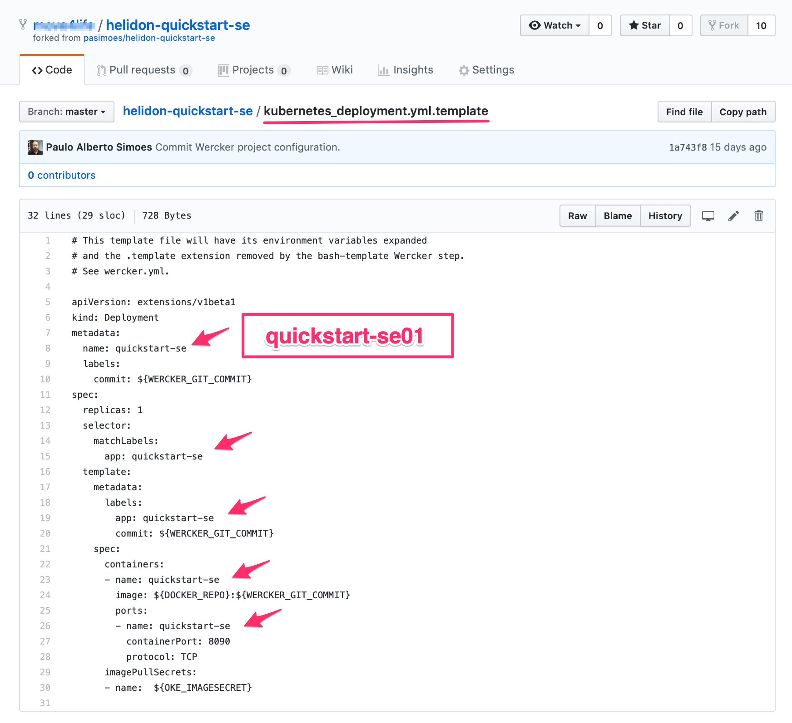
    
    - kubernetes_service.yml.template

    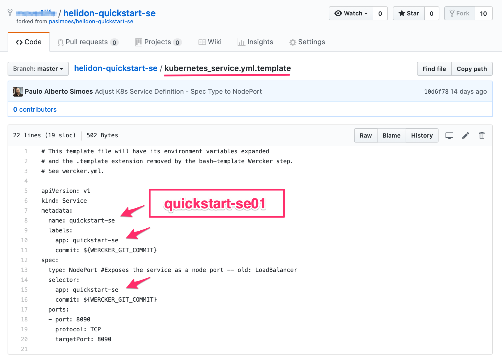

    - wercker.yml
    
    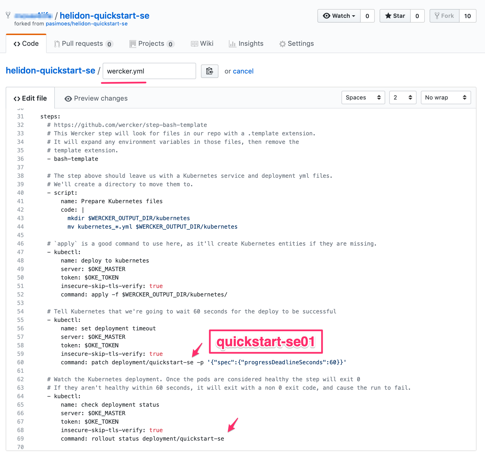
    
3. Select the *wercker.yml* file to open it.

4. Any Docker Image created by the Wercker application will be tagged with the corresponding Git commit that triggered its run. This is a Wercker best practice that ensures a given revision of your source is included in a known single artifact image. This aids in observability as well as making it easy to point Kubernetes at new changes to the application. The environment variables that need to be passed to Wercker will be:
    - OCIR_USERNAME
    - OCIR_PASSWORD
    - OCIR_REPO
    - OCIR_ADDR

## Create Wercker application

4. Open and login to your Wercker account. Click on ```+``` option and choose **Add application** .


5. Make sure your user is selected for #1 and GitHub is selected for #2 and click **Next**.

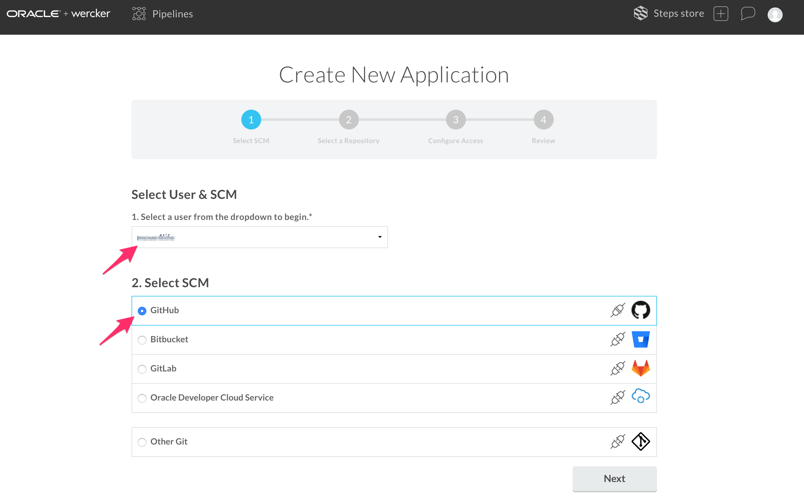

6. Select the ```helidon-quickstart-se``` application you previously forked and click **Next**.

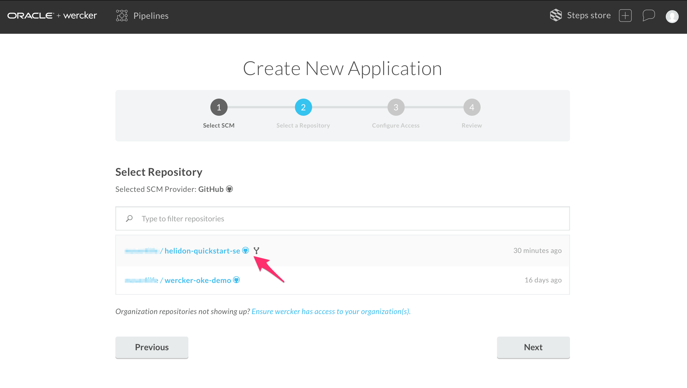

7. Accept the default to checkout the code and click **Next**.

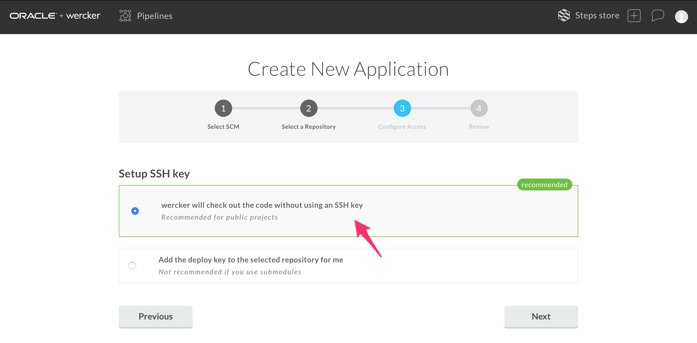

8. Click **Create**.

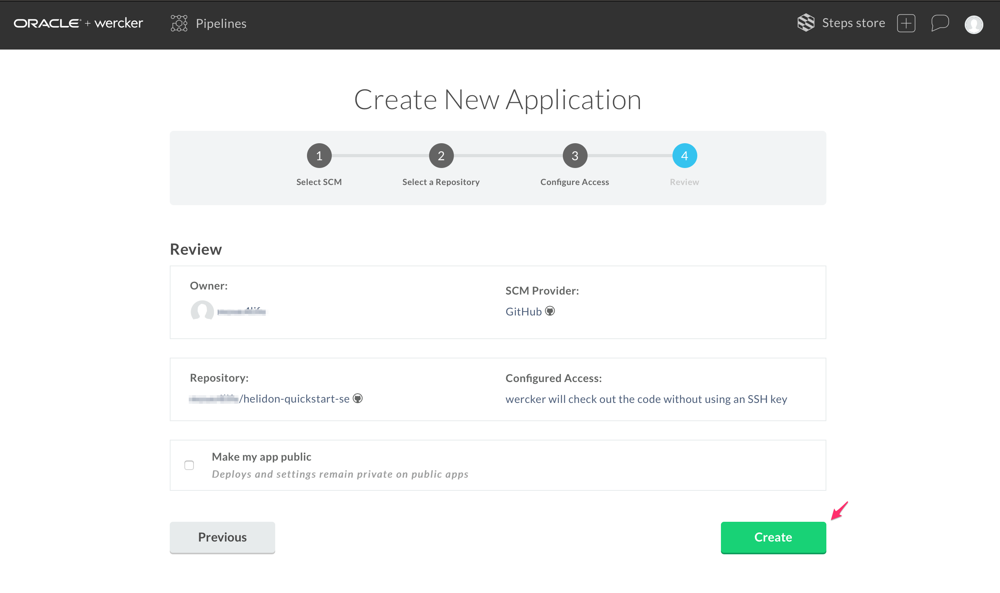

9. Your application was created successfully. In the next section, you define the environment variables. Click the **Environment** tab.

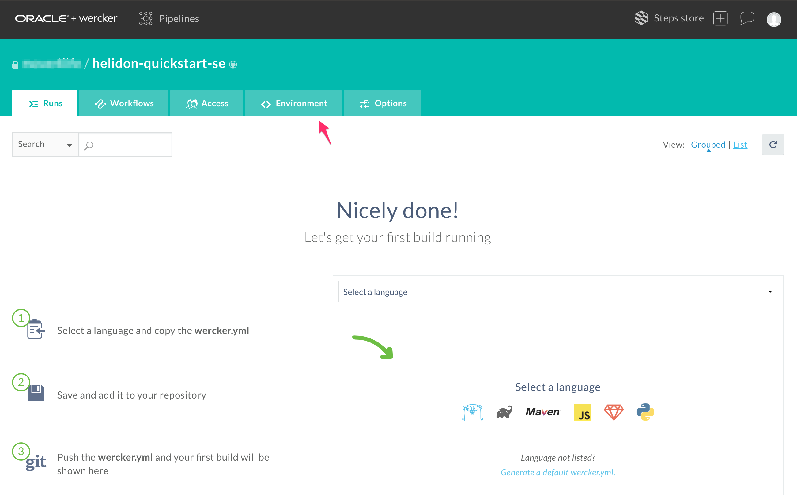

## Set Application Environment Variables

1. Create each of the following environment variables and click Add after each one.

    - OCI Registry Username must include the `<tenancy name>/<username>`
    - OCI Registry Password is the `auth_token` for your cluster. Click **Protected** checkbox. NOTE: It must not contain a `$` character.
    - OCI Registry Repo must include `<region-code>.ocir.io/<tenancy name>/<registry name>`
    - OCI Registry Address
    When done, click the **Run** tab.

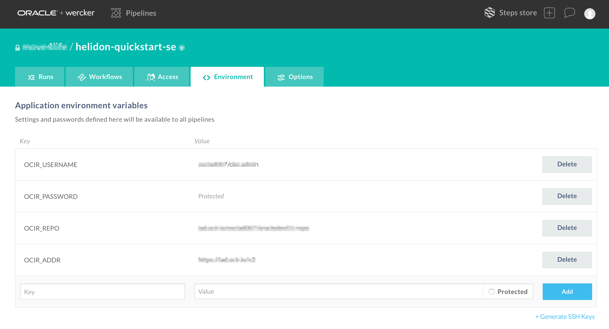

2. Test that the application can be built and pushed to OCIR. Navigate to **Runs** tab and Click the **trigger a build now** link at the bottom of the page.

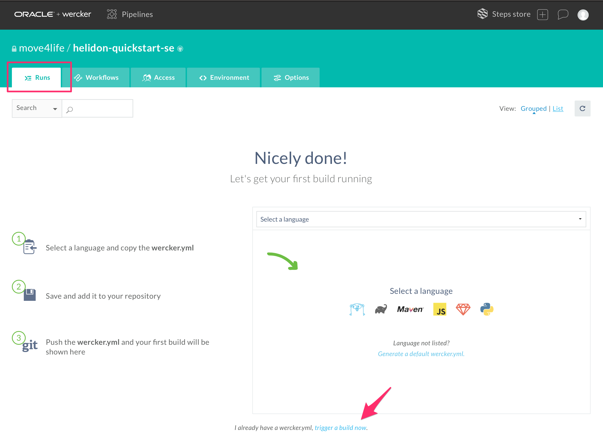

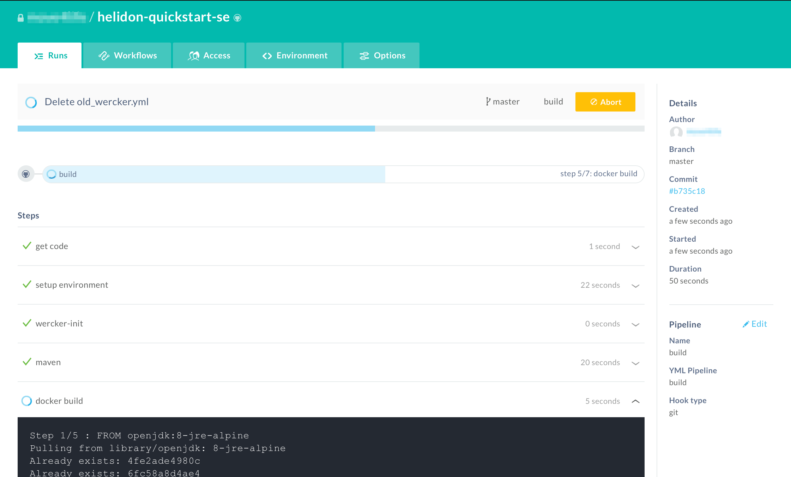

3. The build is completed successfully.


## Configure Cluster to Pull Images from OCI Registry

In order for the images to pulled during deployment, you need to configure the cluster by creating an image secret and setting some additional parameters in your Wercker application.

1. The Kubernetes configuration file references the *image secret* using the environment variable ``OKE_IMAGESECRET`` which you need to create as an environment variable in your Wercker application.

    - Key: ``OKE_IMAGESECRET`` (provided by the instructor)

2. Switch to Wercker click the **Environment** tab.

3. Enter the Key ``OKE_IMAGESECRET`` and Value `<secret name>` and click **Add**.

4. Repeat the inclusion of parameters : 
    - Key: ``OKE_MASTER`` (provided by the instructor)
    - Key: ``OKE_TOKEN`` (provided by the instructor)

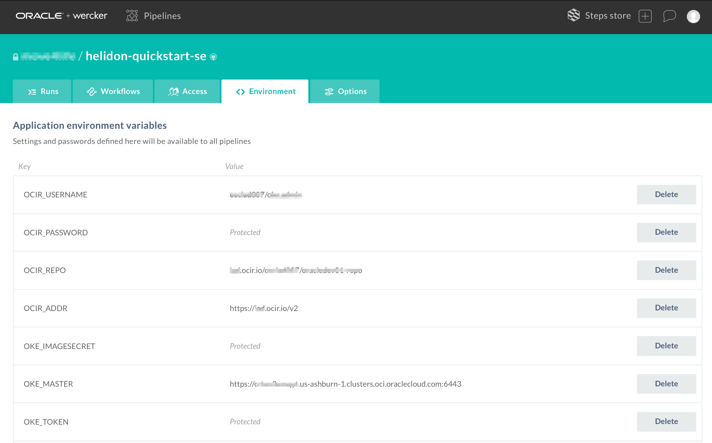

5. To review the script when a deploy to kubernetes is performed, switch to GitHub and open the ```wercker.yml``` file.

6. Scroll to the ```deploy-to-kubernetes``` area. The first step is that all the .template extensions are removed. Then it will move all the Kubernetes configuration files to a clean directory for consumption by kubectl commands.

7. These steps in the configuration file do the following:
    - Set a timeout on the deployment of 60 seconds, giving the deployment time to successfully start the application's container before timing out.
    - Watch the status of the deployment until all pods have come up. If the timeout is hit this will immediately return a non zero exit code and cause the pipeline run to fail. This means your pipeline will succeed only if your application has been successfully deployed, otherwise it fails

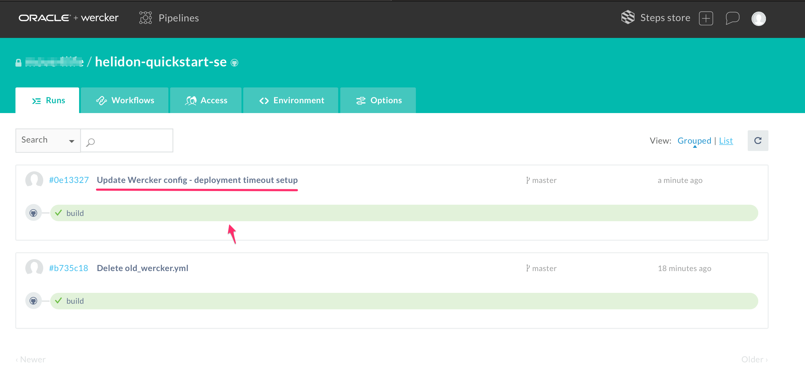

## Add Workflow to Pipeline in Wercker Application

To deploy the OCI Container Engine for Kubernetes (OKE), you need to create a ```Deploy-to-Kubernetes``` workflow in your Wercker application.

1. Switch to your Wercker application and on the **Workflows** tab. Click Add *New Pipeline*.

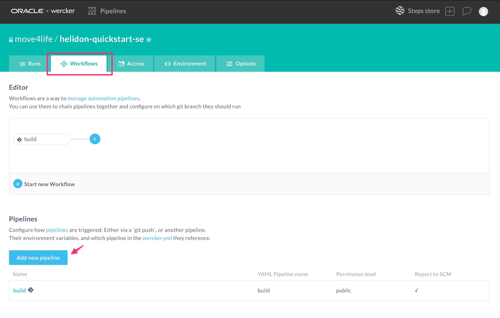

2. Enter **deploy-to-kubernetes** for both Name and YML Pipeline name and click **Create**.

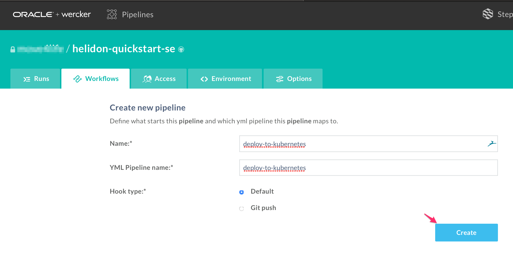

3. Click the **Workflows** tab.

4. In the Workflow Editor, click the `' + '`, to create a new pipeline chain after the build. Select **deploy-to-kubernetes** for Execute pipeline and click **Add**.


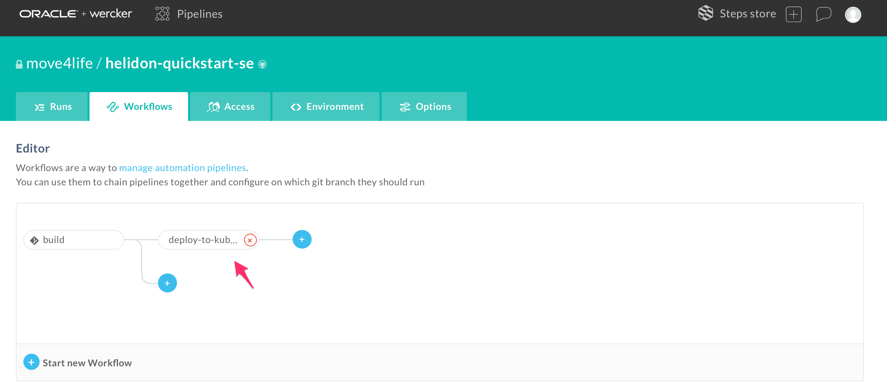

5. The new change in the workflow was created successfully. In the next section, you deploy the OCI image to kubernetes.

## Deploy the OCI Container to OCI Container Engine for Kubernetes

1. Switch to **Runs** tab. Click on the last **build** pipeline to show its execution. On **Actions** button Click ```deploy-to-kubernetes```
The deployment pipeline starts and perform the deployment of the container to OKE.


2. Your deployment completed successfully.

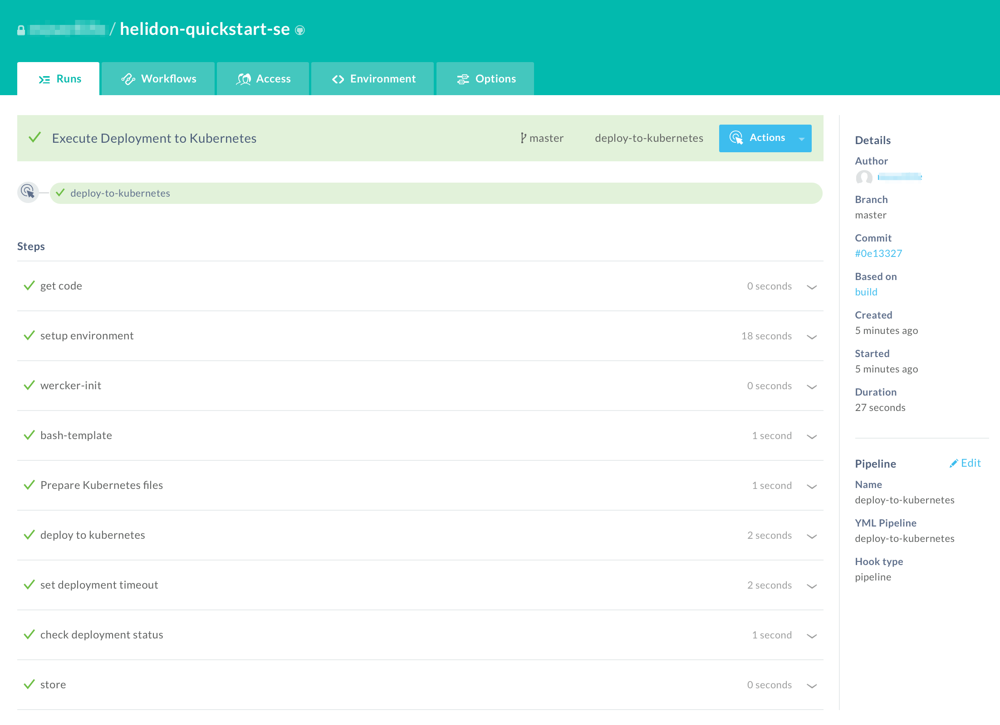


## Verifying Service in OCI Container Engine for Kubernetes

You can verify the service by running the app in OCI Container Engine for Kubernetes .

>   Access from Container Native Terminal on OCI.
>
>   For participants that don't have OCI Cli and Kubectl installed, we prepared some *Container Native Terminals*. 
>   
>   $ ssh opc@``<node-address>`` -i ``<ssh-key>``
>   [opc@oracledev ~]$
>


1. From your terminal window, execute the following:

    ```
    export KUBECONFIG=~/kubeconfig
    kubectl get services
    ```


2. Paste the value for EXTERNAL-IP into your browser to run the application.

3. Assemble the url to access the helloworld application, in the form ``http://<node-address>:<port-number>``. Obtain the values of ``<node-address>`` and ``<port-number>`` from the Kubernetes Dashboard as follows:

    - To find out the ``<node-address>``, consult information about the pod running the **quickstart-se** app, and obtain the address of the node running it from the NODE column. For example, 132.145.140.4.
    ```
        $ kubectl get pods --output=wide
        NAME                                    READY   STATUS    RESTARTS   AGE   IP            NODE
        hello-k8s-deployment-6dcbb9998b-jps7d   1/1     Running   0          8d    10.244.1.2    132.145.140.4
        quickstart-se-7bcfd74777-8rt4b          1/1     Running   0          1h    10.244.1.11   132.145.140.4
    ```
    


    - To find out the ``<port-number>``, consult information about the **quickstart-se**, and obtain the port that the service is running on from the PORT(S) column. For example, port 30151.
    ```
        $ kubectl get services quickstart-se
        NAME            TYPE       CLUSTER-IP      EXTERNAL-IP   PORT(S)          AGE
        quickstart-se   NodePort   10.96.137.252   <none>        8090:30151/TCP   1h
    ```


4. Open a new browser window and enter the url to access the **quickstart-se** application in the browser's URL field. For example, the full url might look like http://132.145.140.4:30151/greet/Larry 

    When the browser loads the page, the page shows a message like:
    `{"message":"Hello Larry!"}`


## Now let's practice Continuous Delivery

The pipeline automatically starts when you make a change to one of your application files in GitHub.

1. Switch to your GitHub application and select the **werker.yml** file.

2. Edit the file.

3. Scroll down to the set deployment timeout area and change the timeout to *300* seconds to make sure there is enough time to complete the deployment. Enter a description for commit and click **Commit changes**.

4. Your change was commited. Switch to Wercker and click the **Runs** tab.

    - Note that the pipeline was executed automatically.
    - After the build completes the deploy workflow runs.

5. Your deployment completed successfully. Click **deploy-to-kubernetes** to view the details.

    - Scroll to the bottom to verify that all the steps completed successfully.
    - Switch to Wercker and click the **Runs** tab.

## Verifying Service in OCI Container Engine for Kubernetes

You can verify the service by running the app in OCI Container Engine for Kubernetes .

>   Access from Container Native Terminal on OCI.
>
>   For participants that don't have OCI Cli and Kubectl installed, we prepared some *Container Native Terminals*. 
>   
>   $ ssh opc@``<node-address>`` -i ``<ssh-key>``
>   [opc@oracledev ~]$
>


1. From your terminal window, execute the following:

    ```
    export KUBECONFIG=~/kubeconfig
    kubectl get services
    ```


2. Paste the value for EXTERNAL-IP into your browser to run the application.

3. Assemble the url to access the helloworld application, in the form ``http://<node-address>:<port-number>``. Obtain the values of ``<node-address>`` and ``<port-number>`` from the Kubernetes Dashboard as follows:

    - To find out the ``<node-address>``, consult information about the pod running the **quickstart-se** app, and obtain the address of the node running it from the NODE column. For example, 132.145.140.4.
    ```
        $ kubectl get pods --output=wide
        NAME                                    READY   STATUS    RESTARTS   AGE   IP            NODE
        hello-k8s-deployment-6dcbb9998b-jps7d   1/1     Running   0          8d    10.244.1.2    132.145.140.4
        quickstart-se-7bcfd74777-8rt4b          1/1     Running   0          1h    10.244.1.11   132.145.140.4
    ```

    - To find out the ``<port-number>``, consult information about the **quickstart-se**, and obtain the port that the service is running on from the PORT(S) column. For example, port 30151.
    ```
        $ kubectl get services quickstart-se
        NAME            TYPE       CLUSTER-IP      EXTERNAL-IP   PORT(S)          AGE
        quickstart-se   NodePort   10.96.137.252   <none>        8090:30151/TCP   1h
    ```

4. Open a new browser window and enter the url to access the **quickstart-se** application in the browser's URL field. For example, the full url might look like http://132.145.140.4:30151/greet/Larry 

    When the browser loads the page, the page shows a message like:
    `{"message":"Hello Larry!"}`


Congratulations! You've successfully deployed the **Helidon Quick Start** Microservice onto a node in the new cluster, and verified that the application is working as expected.
